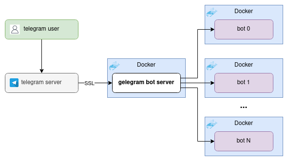

# Telegram bots server
Server, for a list of telegram bots, with webhooks and FastAPI.  
  
The benefit of this structure is that it is possible to serve multiple bots without restarting all bots while working with a specific bot.
#### Requirements
* Domain name, linked to IP of your machine
* Docker
* Docker-compose
* Telegram bot token
#### Installation
* Clone the repo:
```
git clone https://github.com/format37/telegram_bot.git
cd telegram_bot
```
* Link your domain name to ip of yor machine  
* Make a cert files on a server machine:  
When asked for "Common Name (e.g. server FQDN or YOUR name)" you need to reply this way:  
your_domain.name
```
openssl genrsa -out server/webhook_pkey.pem 2048
openssl req -new -x509 -days 3650 -key server/webhook_pkey.pem -out server/webhook_cert.pem
```
* Build:
```
sh build.sh
```
* Update the config.json and bots.json with your configuration  
* Run
```
sh run.sh
```