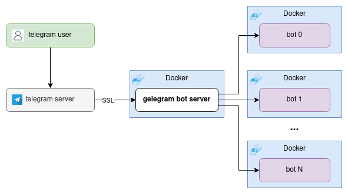

# Telegram bots server
Local server, for a list of telegram bots, with webhooks and FastAPI.  
  
The benefit of this structure is that it is possible to serve multiple bots without restarting all bots while working with a specific bot.
### Requirements
The 8000 TCP port Should be opened for inbound connections and should Not be occupied by anything like Portainer.
## Installation
Use docker image(https://hub.docker.com/r/aiogram/telegram-bot-api)  
or install  locally:
```
sudo apt-get update
sudo apt-get upgrade
sudo apt-get install make git zlib1g-dev libssl-dev gperf cmake g++
git clone --recursive https://github.com/tdlib/telegram-bot-api.git
cd telegram-bot-api
rm -rf build
mkdir build
cd build
cmake -DCMAKE_BUILD_TYPE=Release -DCMAKE_INSTALL_PREFIX:PATH=.. ..
cmake --build . --target install
cd ../
ls -l bin/telegram-bot-api*
```
## Get API ID and Hash
1. Go to https://my.telegram.org/auth
2. Log in with your phone number
3. Click on [API Development Tools](https://my.telegram.org/apps)
4. Fill in the required fields
5. Click on Create Application
6. Copy the API ID and Hash
## Test run
Replace YOUR_API_ID and YOUR_HASH with your API ID and Hash
```
./bin/telegram-bot-api --api-id=YOUR_API_ID --api-hash=YOUR_HASH --local
```
## Run as a daemon
Edit the file
```
sudo nano /etc/systemd/system/telegram-bot-api.service
```
Paste the following content (replace FOLDER_TO_CLONED_REPO, YOUR_APP_ID and YOUR_HASH with your FOLDER_TO_CLONED_REPO, API ID and Hash)
```
[Unit]
Description=Telegram Bot API
After=network.target

[Service]
Type=simple
ExecStart=FOLDER_TO_CLONED_REPO/telegram-bot-api/bin/telegram-bot-api --api-id=YOUR_APP_ID --api-hash=YOUR_HASH --local
Restart=always
RestartSec=10

[Install]
WantedBy=multi-user.target
```
Save and close the file
```
sudo systemctl daemon-reload
sudo systemctl enable telegram-bot-api
sudo systemctl start telegram-bot-api
```
Check the status
```
sudo systemctl status telegram-bot-api
```
Read the logs
```
sudo journalctl -fu telegram-bot-api --since today
```
## Bots (bots.json)
One entry per bot. The copy in git is an example with empty tokens; never commit a real one, and edit it with a JSON-aware tool rather than sed.
```
{
    "MY_BOT": {
        "TOKEN": "123456:ABC...",
        "PORT": 4221,
        "active": 1,
        "forward_edits": 1,
        "num_threads": 8
    }
}
```
| Key | Meaning |
|---|---|
| `TOKEN` | Bot token. |
| `PORT` | Port of the bot's own server; updates are POSTed to `{bot_url_prefix}:{PORT}/message`. |
| `active` | `1` to serve the bot, `0` to skip it. |
| `bot_url_prefix` | Optional, default `http://localhost`. |
| `group_starters` | Optional list of prefixes. In groups, only messages (and edits) whose text or caption starts with one of them are forwarded. |
| `forward_edits` | Optional, default `0`. With `1`, edited messages are POSTed to `{bot_url_prefix}:{PORT}/edited_message` (timeout 10 s, the response is ignored). Enable it only for a bot that has that endpoint: without the flag the relay drops edits, as it always did. |
| `num_threads` | Optional, default `2`. Worker threads for the bot's updates. A forward holds a worker until the bot has answered, so a bot that answers slowly and must still receive edits (or other messages) meanwhile needs more. |

`bots.json`, `config.json` and `logging.ini` are bind-mounted, so changing them needs only `sudo docker restart bots_server_telegram`. A change to `server/server.py` needs a rebuild (`bash compose.sh`).

The relay logs the webhook URL, which contains the token, and the text of the messages it handles: share its log with care.

## Tests
```
python3.9 -m venv .venv && .venv/bin/pip install -r server/requirements.txt pytest httpx
.venv/bin/python -m pytest tests -q
```
No Telegram is involved: webhook calls are stubbed and forwards are recorded.

## Log out your bot from the cloud server (if bot had webhooks at the cloud server)
You have to input the bot token
```
cd logout
python3 -m pip install -r requirements.txt
python3 logout.py
```
## Run with initial cloud telegram server (Optional)
1. Define the config.json file. For example:
```
{
    "WEBHOOK_HOST":"service.icecorp.ru",
    "WEBHOOK_PORT":"8443",
    "SERVER_API_URI": "",
    "SERVER_FILE_URL": ""
}
```
2. Dockerfile: Uncomment the Cloud server section and comment the Local server section
3. Obtain the cert files using certbot
4. compose.sh: Uncomment the Cloud server section and update folders
